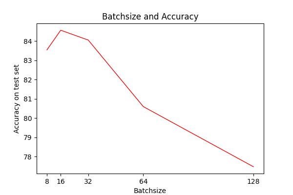
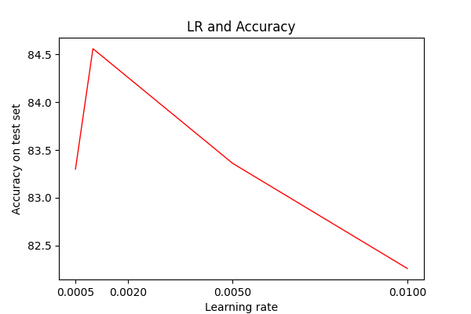

### Experiments on CIFAR10 classification

This is a easy demo for experiments for CIFAR10 classfication, and choose the resnet18 as the model.  
Also, this experiment shows the relationship of accuracy and hyper-parameters,like batchsize,learning rate.

**Run this training demo**
```
python main.py 
```
You can modify the hyper-params by add options,for example:
```
python main.py --lr 0.001 --batchsize 16 --epochs  30 --weight_decay 5e-4
```

#### Experiment results
First, fix the learning rate as 0.001, and change the batchsize, get results as follows:


Next, choose the best batchsize=16, and change the learning rate, get results as follows:


**The best hyperparameter combination is lr=0.001,batchsize=16**